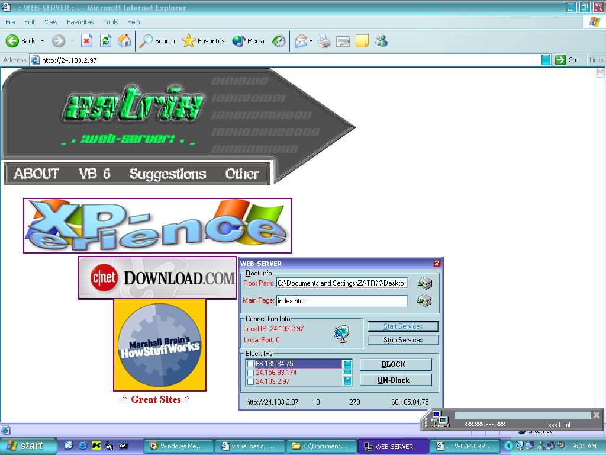



## WEB\-SERVER \[winsock\]

### Description

Everwanted to host a web-page? Probably! I have put together a SIMPLE server for the web. If you look at the screen shot it has a skinned protion, and the main program is REALLY easy to use. This simply uses winsock! Download it and see. If you don't like it don't bother voting, if you do like it and or find it usefull please do leave either votes or comments. I'm very keen on hearing your responses! I have built and included a webpage to be tested. It's located in the \wwwROOT\ directory!

I have also commented all the my code, except the

API, module, and ActiveX code cause chunks were not mine. I'm really sorry but i can't recall where i got which code.

Enjoy!:D
 
### More Info
 
I have noted that for some reasons on some slow machines the pages do not load. I have AMD 1.4 so i only tested it on my machine. I also ran the server and asked my cousin to connect. He did and it all worked. BUT MAKE SURE THAT IF YOU ARE USING WINDOWS XP TO NOT USE THE CONNECTION FIREWALL, BECAUSE FOR SOME REASON IT BLOCKS THE ATTEMPT TO CONNECT! Sorry if it doesn't work for u!

             |
---                |---
**Submitted On**   |2002-03-10 11:45:30
**By**             |[ZATRiX](https://github.com/Planet-Source-Code/PSCIndex/blob/master/ByAuthor/zatrix.md)
**Level**          |Intermediate
**User Rating**    |4.5 (36 globes from 8 users)
**Compatibility**  |VB 6\.0
**Category**       |[Complete Applications](https://github.com/Planet-Source-Code/PSCIndex/blob/master/ByCategory/complete-applications__1-27.md)
**World**          |[Visual Basic](https://github.com/Planet-Source-Code/PSCIndex/blob/master/ByWorld/visual-basic.md)
**Archive File**   |[WEB\-SERVER612143112002\.zip](https://github.com/Planet-Source-Code/zatrix-web-server-winsock__1-32582/archive/master.zip)

